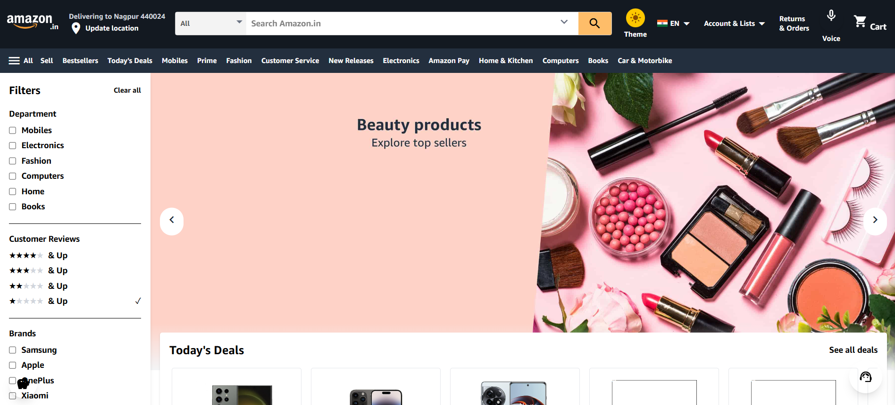
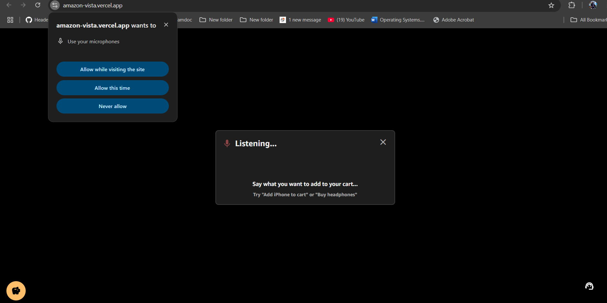
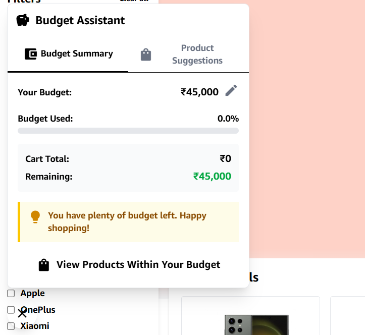
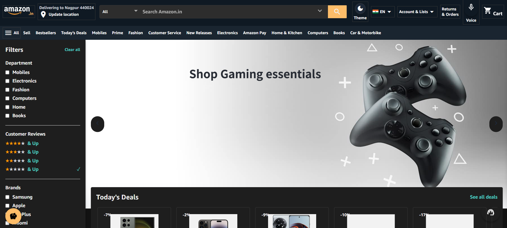
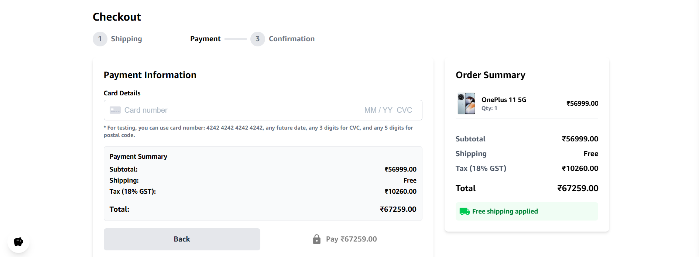

# Amazon Vista - Next-Generation E-Commerce Platform

<!-- Light Mode Screenshot -->


## 🚀 Reimagining Amazon with Advanced AI & User-Centric Features

Amazon Vista is a cutting-edge e-commerce platform that replicates the core Amazon shopping experience while introducing innovative features powered by AI and focused on user convenience. This project goes beyond a simple clone by integrating voice shopping, AI-powered recommendations, budget management, and eco-conscious shopping tools.

## ✨ Key Features

### 🎙️ Voice Shopping

Add products to your cart using just your voice! Simply click the microphone icon and say commands like "Add iPhone to cart" or "Buy headphones" to shop hands-free.

<!-- Voice Shopping Feature -->


#### How to use:
1. Click the microphone icon in the navigation bar
2. When the "Listening..." dialog appears, speak your command
3. Use commands like:
   - "Add iPhone to cart"
   - "Buy headphones"
   - "Remove shoes from cart"
4. The system will process your command and update your cart accordingly

### 🤖 Gemini AI Product Recommendations

Get personalized product suggestions through our AI-powered chatbot. The recommendation engine uses Google's Gemini API to understand your preferences and suggest relevant products.

#### How it works:
- The system analyzes your browsing and purchase history
- Gemini AI processes this data to identify patterns and preferences
- The AI generates personalized product recommendations
- You can also chat directly with the recommendation bot for specific suggestions

### 💰 Budget Assistant

Set your shopping budget and get product recommendations that fit within your remaining budget. The Budget Assistant helps you:

<!-- Budget Assistant Feature -->


- Track your spending in real-time
- View your budget summary and remaining funds
- See products that fit within your budget constraints
- Get personalized recommendations based on your spending habits
- Receive budget alerts and shopping suggestions

### ♻️ Eco-Friendly Shopping

Make environmentally conscious purchasing decisions with:
- Eco-friendly product tags highlighting sustainable options
- Carbon footprint information for products and shipping methods
- Sustainability ratings to compare environmental impact
- Eco-friendly alternatives suggestions for high-impact products

### 🌓 Dark Mode Support

Enjoy a comfortable shopping experience day or night with our elegant dark mode option.

<!-- Dark Mode Feature -->


### 🛒 Complete Shopping Experience

- Comprehensive product catalog across multiple departments:
  - Mobiles
  - Electronics
  - Fashion
  - Computers
  - Home
  - Books
  - And more!
- Detailed product pages with specifications, reviews, and ratings
- Full cart and checkout functionality with Stripe payment integration
- Responsive design for all devices from mobile to desktop

## 🛠️ Technologies Used

- **Frontend**: React.js, TailwindCSS
- **State Management**: React Context API
- **AI Integration**: Google Gemini API
- **Voice Recognition**: Web Speech API
- **Payment Processing**: Stripe API
- **Animations**: CSS Animations, Transitions
- **Deployment**: Vercel/Netlify

## 📋 Installation & Setup

### Prerequisites
- Node.js (v14.0.0 or later)
- npm (v6.0.0 or later)

### Installation Steps

1. **Clone the repository**
   ```bash
   git clone https://github.com/yourusername/amazon-vista.git
   cd amazon-vista
   ```

2. **Install dependencies**
   ```bash
   npm install
   ```

3. **Set up environment variables**
   Create a `.env` file in the root directory with the following:
   ```
   REACT_APP_GEMINI_API_KEY=your_gemini_api_key
   REACT_APP_STRIPE_PUBLIC_KEY=your_stripe_public_key
   ```

4. **Start the development server**
   ```bash
   npm start
   ```
   The application will be available at `http://localhost:3000`

### Getting a Gemini API Key

1. Go to [Google AI Studio](https://makersuite.google.com/)
2. Sign in with your Google account
3. Navigate to the API Keys section
4. Create a new API key
5. Copy the key and add it to your `.env` file

### Setting Up Stripe (Optional)

1. Create a [Stripe account](https://stripe.com)
2. Navigate to the Developers > API keys section
3. Copy your publishable key
4. Add it to your `.env` file as `REACT_APP_STRIPE_PUBLIC_KEY`

## 🚀 Deployment

To deploy the application:

1. **Build the production version**
   ```bash
   npm run build
   ```

2. **Deploy to your preferred platform**
   - For Vercel:
     ```bash
     npx vercel
     ```
   - For Netlify:
     ```bash
     npx netlify deploy
     ```

## 🧪 Testing

Run the test suite with:
```bash
npm test
```

For end-to-end testing:
```bash
npm run test:e2e
```

## 📱 Browser & Device Compatibility

### Voice Command Feature
The Voice Command feature requires a browser that supports the Web Speech API:
- Chrome (desktop and mobile)
- Edge
- Safari (iOS 14.5+ and macOS)
- Firefox (with flag enabled)

### Responsive Design
The application is fully responsive and optimized for:
- Desktop computers
- Tablets
- Mobile phones (portrait and landscape)

## 🤝 Contributing

Contributions are welcome! Please feel free to submit a Pull Request.

1. Fork the repository
2. Create your feature branch (`git checkout -b feature/amazing-feature`)
3. Commit your changes (`git commit -m 'Add some amazing feature'`)
4. Push to the branch (`git push origin feature/amazing-feature`)
5. Open a Pull Request

## 📝 License

This project is licensed under the MIT License - see the LICENSE file for details.

## 🙏 Acknowledgements

- [Amazon](https://www.amazon.com) for the inspiration and UI reference
- [Google Gemini API](https://ai.google.dev/) for AI-powered recommendations
- [Web Speech API](https://developer.mozilla.org/en-US/docs/Web/API/Web_Speech_API) for voice recognition
- [Stripe](https://stripe.com) for payment processing integration
- [React](https://reactjs.org/) and [TailwindCSS](https://tailwindcss.com/) for frontend development

---

<p align="center">
  <a href="https://amazon-vista.vercel.app">View Live Demo</a> •
</p>

<!-- Checkout Process -->

